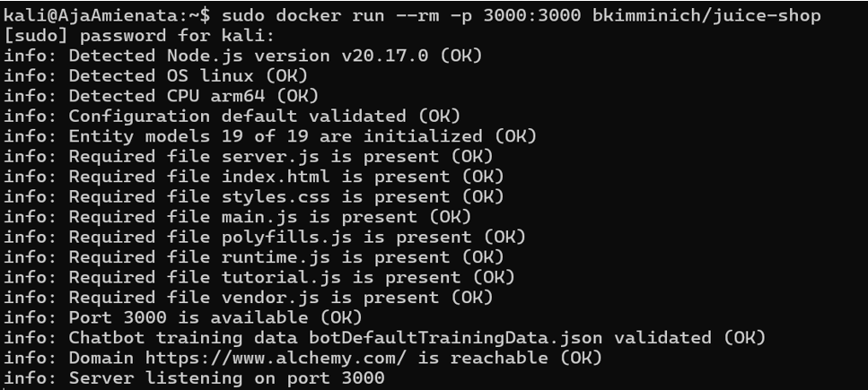
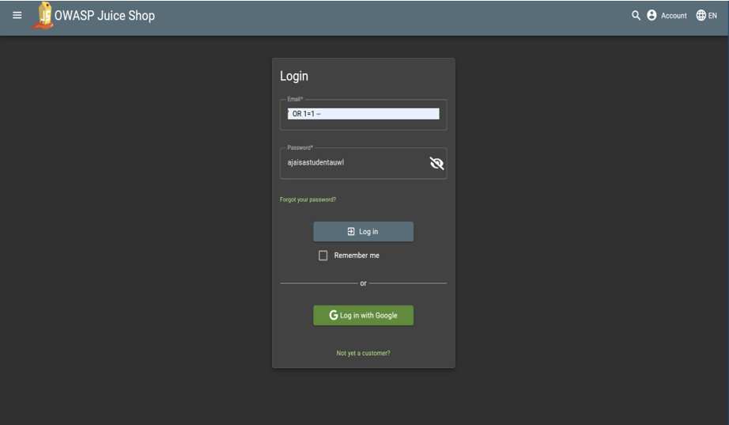
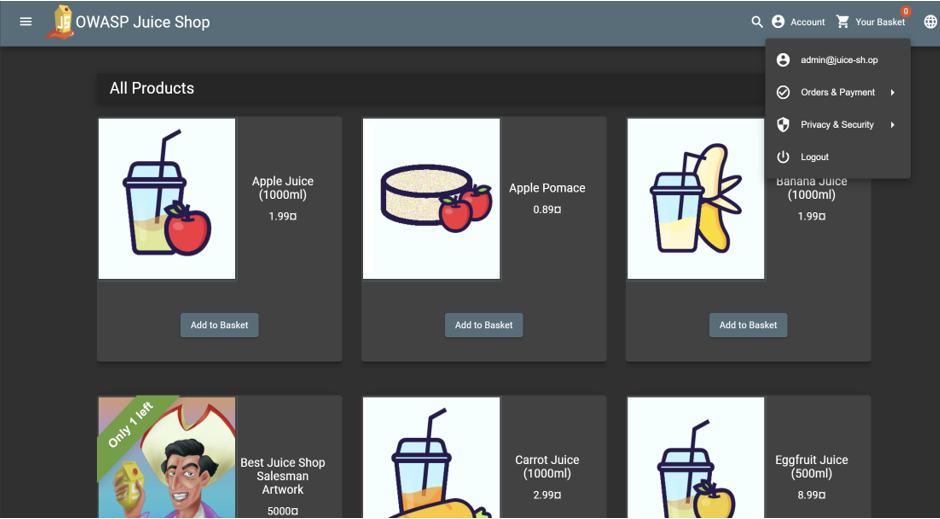
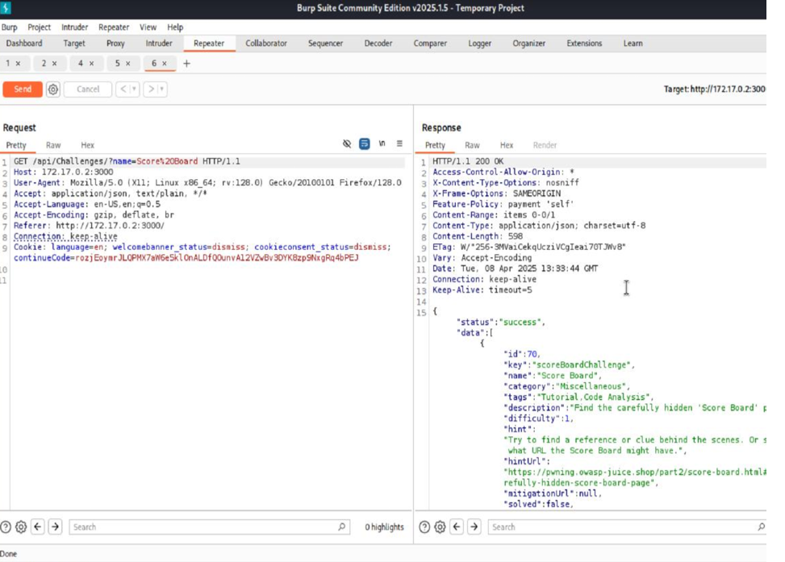
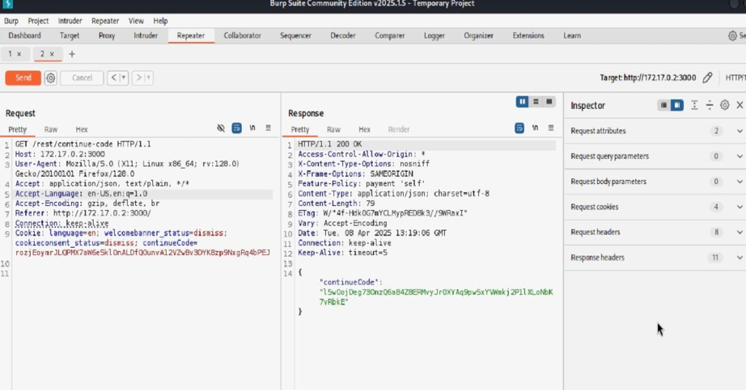

# OWASP Juice Shop — SQL Injection Analysis (Burp Suite)

**Author:** Aja Amienata Sanyang  
**Type:** Independent web-app security lab

---

## Overview
I set up a local instance of OWASP Juice Shop in Docker and explored how input handling issues could be observed.  
Using Burp Suite I intercepted and analysed requests, collected screenshots as evidence, and wrote up recommendations for developers and defenders.  
This was done in a safe, authorised lab environment.

---

## Tools Used
- OWASP Juice Shop (Docker)
- Burp Suite (proxy & repeater)
- Firefox / Chrome browser
- Docker on Kali Linux

---

## Objectives
- Run OWASP Juice Shop locally in Docker  
- Identify and test an input point showing abnormal behaviour  
- Use Burp Suite to intercept and replay requests  
- Document evidence and provide remediation advice

---

## Evidence (screenshots)

  

  

  

  

  

---

## Findings (summary)
- An input point in the lab instance responded abnormally when tested, indicating poor input handling.  
- Burp Suite interception showed clear differences between normal and altered requests.  
- Responses suggested a vulnerability class linked to unsanitised input.

---

## Recommendations
- Use parameterised queries / prepared statements for database calls  
- Enforce strict input validation and sanitisation  
- Avoid exposing verbose server/database error messages  
- Apply least-privilege database accounts and implement WAF logging/monitoring

---

## What I Learned
- How to run Juice Shop with Docker and access it locally  
- How to use Burp Suite for request/response inspection  
- How to present security findings in developer-friendly language

---

## Ethical Note
All testing was done on an intentionally vulnerable local lab for learning purposes only.  
Do not perform these activities on systems without explicit permission.

